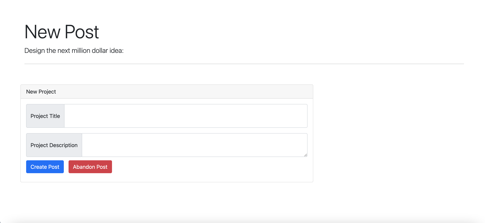

# MVC Tech Blog

In this week's assignment we were asked to make a tech blog website.

### 1. Getting Started

To access the website, simply click this link.

### 2. Sign Up

In order to create, edit and delete posts you will need to create an account. You can

### 3. Log In

If you already have an account simply sign in.

### 4. Dashboard

Once you have logged in, you may view the posts you've made. 

### 5. Home

If you wish to see other posts you can go to the homepage.

### 6. New Posts

If you wish to make a new post, make sure you are logged in and click the "Create Post" button.

### 7. Edit Posts

If you want to change or delete a post, edit your posts from your dashboard.

